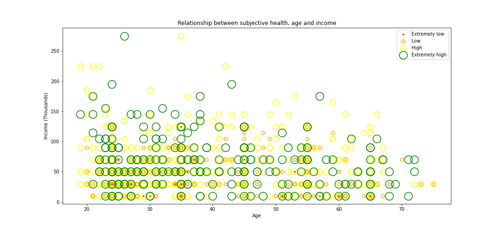
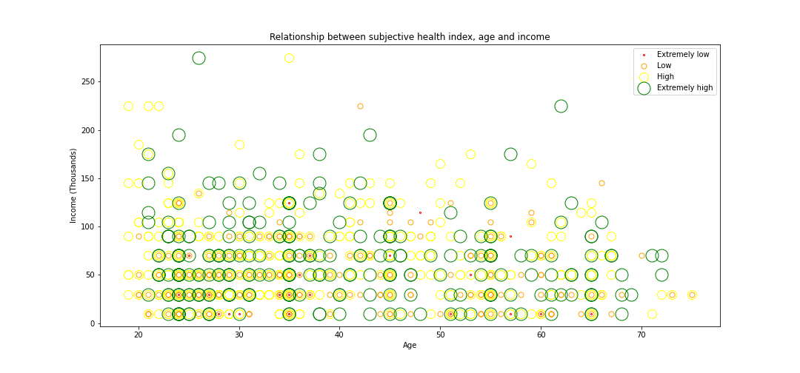

# Data Task
### Rodrigo Grijalba

## Question 1

### (a) Load ratings.csv

```py
ratings = pd.read_csv('ratings.csv') 
```

### (b) Report the number of unique aspects and unique respondents:

There are 17 aspects measured, and 1056 unique respondents

### \(c\) Check if the number each responder rated each aspect only once. If not, include only the most recent observation. Report the number of observations you have dropped

When getting rid of the duplicates, 237 observations were dropped

### (d) Calculate subjective riches for each worker, which is the average of all the ratings given to each aspect. Report minimum and quartiles

||min|25%|50%|75%|max|
|---|---|---|---|---|---|
|Subjective Riches|5.76|49.03|61.44|75.01|100|

## Question 2

### (a) Load demographics.csv

```py
demo = pd.read_csv('demographics.csv') 
```

### (b) Report the number of rows and check to see if it is the same as the number of unique respondents

The number of rows is 1056, which is the same the number of unnique respondents previously calclulated.

### \(c\) Merge the dubjective riches data with the demographic data

```py
demo_sub = demo.merge(subjective_riches, on = 'worker')
```

### (d) OLS regression of subjective riches on income

")

The model clearly implies that there is a significant correlation between income and subjective riches, with a high t-statistics (6.45). Nonetheless, there is a clear lack of explanatory power in this model: the R-squared score is only .04, extremely low. As for the interpretability of the results, one could say that one increment of 1000 monetary units in income would be associated to a .09 increment of subjective riches. It is possible, regardless, that there are bilateral effects: happier people might be more motivated to work, for example.

## (e) OLS regression of subjective riches on income

")

In this model, income remains a significant factor in its association with subjective riches. Apart from that, the only added variable that is significant at the standard levels is being male. This is associated with an additional 2.55 points of subjective riches over being female. Regardless, this model isn't much more powerful than the previous one (R-squared = .06). Added to this, there are likely storng multicolinearity issues among the explanatory variables: it is likely that income, age, and education are closely related to each other. In any case, it would be possible to do partial F-tests to better assess the comparative fitness of the models.

## (f) How would you change your analysis if you were given the respondent's household size?

A couple of possible approaches come to mind. The first and simplest one would be to add the household size to the first model, possibly also adding gender too. It is very likely, nevertheless, that total household income is strongly correlated with household size, even if the latter would likely not be associated with the other explanatory terms. Therefore, a better approach would be to calculate household income per-capita. This measure also has the advantage of reflecting the available income of the respondant, assuming household income is equaly distributed among its members.

# Question 3

## (a) List the steps you would take to produce a scatterplot that represents the relationship between subjective ratings of health, income, and age.

1. Taking into account that it has to be an easily understandable figure with all three variables included, I would prefer not to use a 3D plot, as they are hard to understand at a glance, like in the context of a presentation. A 2D figure would suffice, and the characteristics of the markers in the plot change to represent the third variable.
2. The third variable, to be represented by size and color, is the subjective health rating or measure. With regards to the usage of color, this is because it is easy to associate different hues with different health statuses: green equals healthy while red equals unhealthy. The reason to use size is to avoid overlap as python generates the plot.
3. Two approaches for the subjective health variables can be choosen: just the aspect of subjective health in the data, or the aspects of subjective health, mental health, and fitness. I use both approaches.
4. I start by creating a variable that classifies the subjective health measure stepwise.
5. Then I associate each step with a color and a size.
6. I group the data by step, and then I loop over each group such that a figure is generated with a different marker color  and size on each pass.
7. Add labels and legend, and it is finished.

## (b) Produce and save the scatterplot(s)





## \(c\) From  a  policy  perspective,  understanding the  determinants of well-being  is an  important question.  Describe the  ways in which your regressions  in the  previous  question  and  your scatterplot(s) help  or  do  not  help  answer  this question.

I find that the most important result from the regressions conducted was the fact that there evidently is a strong relationship between income and self-reported, overall happiness. It is necessary to keep in mind, as I mentioned earlier, that it is possible that there exists a bilateral relationship between both variables. Not only that, but the construcction of an overall hapiness index, consisting on the average of several other self-reported subjective wellbeing ratings, might not be ideal. This is because this approach does not take into account the different weights that are given to each aspect by an individual or a community. It is possible that a future survey could take this into consideration and ask about these weights, but it is likely they would be difficult to handle given the very subjective nature of the measurements being made. On the other hand, it might be possible and interesting to find some fainter associations through graphical analysis, even if this approach does not result directly in robust estimations of the relationship between variables. More specifically, visually analysing the relationship between age, subjective health, and income probably does not directly answer any policy questions, but does help towards ideating different pathways for future research that might. 


